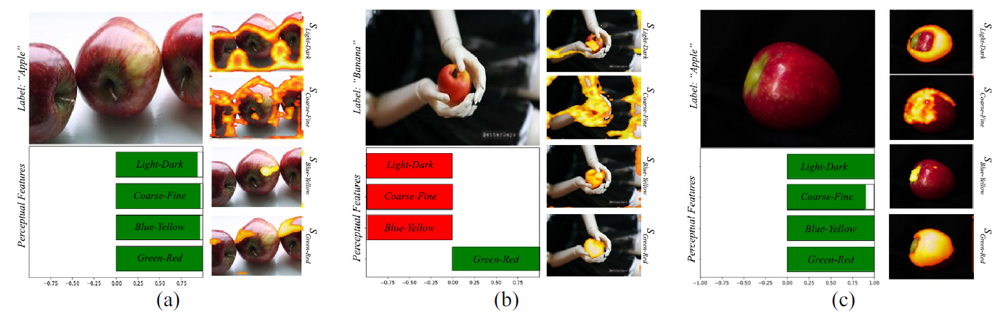
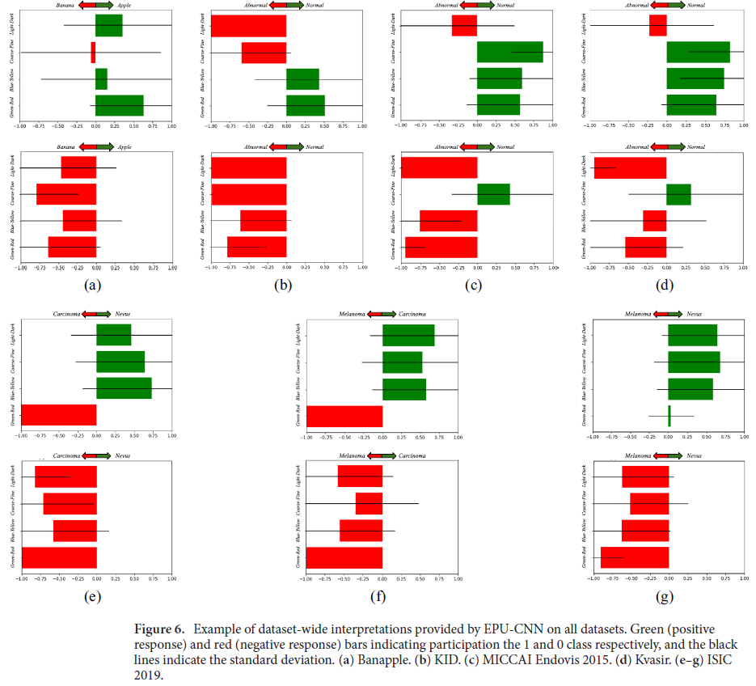

# EPU-CNN
[](https://github.com/innoisys/EPU-CNN/)
[](README.md)
[](https://opensource.org/licenses/MIT)

This is the official <b>Tensorflow</b> implementation of ["E pluribus unum interpretable convolutional neural networks"](https://www.nature.com/articles/s41598-023-38459-1).


## Paper Abstract
The adoption of convolutional neural network (CNN) models in high-stake domains is hindered by their inability to meet 
society’s demand for transparency in decision-making. So far, a growing number of methodologies have emerged for 
developing CNN models that are interpretable by design. However, such models are not capable of providing 
interpretations in accordance with human perception, while maintaining competent performance. In this paper, 
we tackle these challenges with a novel, general framework for instantiating inherently interpretable CNN models, 
named E pluribus unum interpretable CNN (EPU-CNN). An EPU-CNN model consists of CNN sub-networks, each of which receives 
a different representation of an input image expressing a perceptual feature, such as color or texture. The output of an 
EPU-CNN model consists of the classification prediction and its interpretation, in terms of relative contributions of 
perceptual features in different regions of the input image. EPU-CNN models have been extensively evaluated on various 
publicly available datasets, as well as a contributed benchmark dataset. Medical datasets are used to demonstrate the 
applicability of EPU-CNN for risk-sensitive decisions in medicine. The experimental results indicate that EPU-CNN models 
can achieve a comparable or better classification performance than other CNN architectures while providing humanly 
perceivable interpretations.

## Usage

**EPU-CNN**, to the best of our knowledge, is the first framework based on **Generalized Additive Models** for the construction of **Inherently
Interpretable CNN models**, regardless of the base CNN architecture used and the application domain.
Unlike current approaches, the models constructed by EPU-CNN enables interpretable classification based both
on perceptual features and their spatial expression within an image; thus, it enables a more thorough and intuitive
interpretation of the classification results.

EPU-CNN is capable of providing both **qualitative and quantitative classification interpretations**. An example of 
image-specific interpretations provided by the EPU-CNN is shown below:



The quantitative interpretations on each image can be used to construct dataset level interpretations, which can be used
to identify the most important perceptual features for the classification task. An example of such an interpretation is
shown below:



To use EPU-CNN, you need to provide a **base CNN architecture** and a **perceptual feature extractor**. In this repository
we provide exemplary base CNN architectures and perceptual feature extractors used in our experimentations. An example of usage
is shown below:

```python
from models.epu import EPUNet
from models.subnetworks import Subnet

# Initialize the EPU-CNN model
epu = EPUNet(init_size=32, subnet_act="tanh", epu_act="sigmoid", 
             subnet=Subnet, num_classes=1, num_pfms=4, 
             fc_hidden_units=512)
```

The `subnet` defines the base CNN architecture. In our implementation `init_size` defines the number of 
features in the first convolutional layers that is incremented  by a factor of **2** in each subsequent convolutional 
block of the base CNN architecture. `hidden_units` defines the number of hidden units in the fully connected layers of
the base CNN architecture. `num_pfms` defines the number of perceptual feature maps used as input for a particular 
application.

The `subnet_act` defines the output activation function of the base CNN architecture and the `epu_act` defines the inverse
of the link function **g** used to provide the final output of the EPU-CNN model.

Currently, the `EPUNet` class has an implementation of `get_pfm` method that can be used to extract the PFMs of 
__green-red, blue-yellow, coarse-fine and light-dark__. The `get_pfm` takes as input a list of images (`np.ndarray`) and
outputs a tuple of PFMs. In its current form, `EPUNet` takes as input for training and inference a `tuple` of PFMs where
each position of the tuple is an `np.ndarray` of shape `(batch_size, height, width, 1)`.

### Training

An example of the training process is provided in the `train.py` script. The `train.py` script can be used to train an
EPU-CNN model given a set of training images and target labels. The `train.py` script can be used as follows:

```python
images_train, images_validation = ...
labels_train, labels_validation = ...
epu = EPUNet(init_size=32, subnet_act="tanh", epu_act="sigmoid", features_num=4,
             subnet=Subnet, fc_hidden_units=512, classes=1)
epu.set_name("example-model")

optimizer = ...

epu.compile(optimizer=optimizer, loss="binary_crossentropy", metrics=["accuracy"], run_eagerly=True)
epu.fit(x=EPUNet.get_pfms(images_train, 128, 128), y=labels_train, epochs=1,
        validation_data=(EPUNet.get_pfms(images_validation, 128, 128), labels_validation),
        batch_size=1, callbacks=[])
```

It is recomended to save the trained model using either the `save_model` function or save the weights using the `np.save`
function. For example. 

```python
epu.save_model("example-model")
# or
np.save("example-model-weights", epu.get_weights())
```

### Interpretations

Currently `EPUNet` provides its interpretations using the `get_interpretation` and `get_prm` methods. The 
`get_interpretation` returns the qunatitative contributions of each **PFM** used whereas `get_prm` returns the
spatial expression of each **PFM** used on the image. To get the exact results with the paper the `get_prm` results need 
to be propagated to the `refine_prm` method of the `EPUNet` class.

To work, call after the loading of the model or the weights to the initialized object of epu don't use the `.predict` method
but call the model as `epu(...)` on a PFM tensor instead.

```python
images = ...
epu = EPUNet(init_size=32, subnet_act="tanh", epu_act="sigmoid", features_num=4,
            subnet=Subnet, fc_hidden_units=512, classes=1)
epu.load_model("example-model")
epu(EPUNet.get_pfm(images[0], 128, 128))

# Get Relevance Similarity Scores 
rss = epu.get_interpret_output()

# Get Perceptual Relevance Maps
prms = epu.refine_prm(epu.get_prm())
```

## Datasets

The datasets below have been used for training and evaluating the EPU-CNN models.

* [Banapple](https://github.com/innoisys/Banapple)
* [KID Dataset](https://mdss.uth.gr/datasets/endoscopy/kid/)
* [Kvasir](https://datasets.simula.no/kvasir/)
* [ISIC-2019](https://challenge2019.isic-archive.com/)
* [CIFAR-10](http://www.cs.toronto.edu/~kriz/cifar.html)
* [MNIST](http://yann.lecun.com/exdb/mnist/)
* [Fashion-MNIST](https://github.com/zalandoresearch/fashion-mnist)
* [iBeans](https://github.com/AI-Lab-Makerere/ibean/)

The **Banapple**, **KID Dataset**, **Kvasir** and **ISIC-2019** have been downloaded from their respective sources and 
have been curated manually for the training and evaluation of EPU-CNN models. The **CIFAR-10**, **MNIST**, 
**Fashion-MNIST** and **iBeans** datasets have been used via the [Tensorflow Datasets API](https://www.tensorflow.org/datasets). 

## TODO

- [X] Add references to all the paper datasets
- [ ] Refine README.md
- [X] Add requirements.txt
- [ ] Implement interpretation visualizations in a nice format
- [ ] Add evaluation code
- [X] Add inference code
- [ ] Add Wavelet PFM extraction
- [ ] Add Multiclass Training and Evaluation code
- [X] Replace the .arxiv with official Scientific Reports citation

## Contributors
* [George Dimas](https://www.linkedin.com/in/george-dimas-ph-d-33230bba/)
* [Eirini Cholopoulou](echolopoulou@uth.gr)
* [Dimitris Iakovidis](http://is-innovation.eu/iakovidis/)

## Citation
If you find this work useful, please cite our paper:

```
@article{dimas2023pluribus,
  title = {E pluribus unum interpretable convolutional neural networks},
  author = {Dimas, George and Cholopoulou, Eirini and Iakovidis, Dimitris K},
  journal = {Scientific Reports},
  volume = {13},
  number = {1},
  pages = {11421},
  year = {2023},
  publisher = {Nature Publishing Group UK London}
}
```
